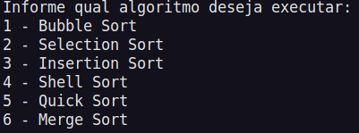
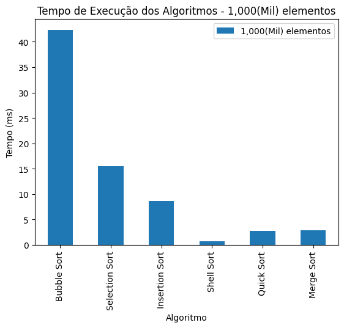
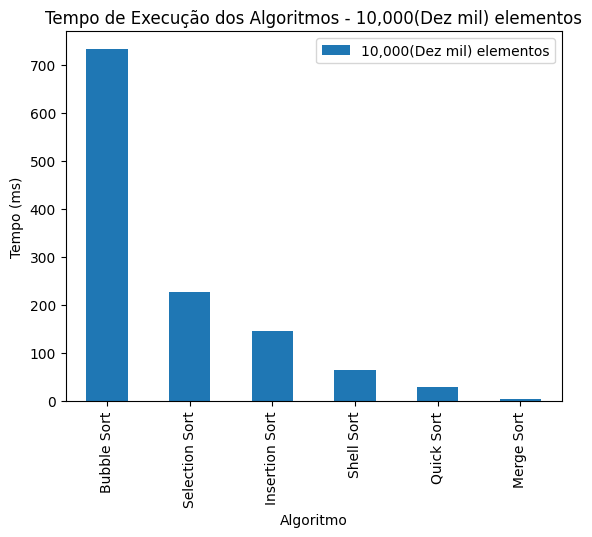
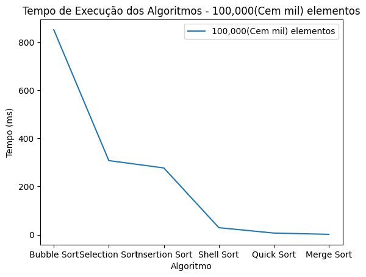

# Análise - Comparação de eficiência entre algoritmos de ordenação

## Introdução

Durante a disciplina de estrutura de dados ministrada no 3° período do curso de Tecnologia em Sistemas para Internet (TSI) foi proposto que implementássemos os algoritmos de ordenação apresentados em sala, e que apartir destes fosse realizada uma análise e comparação do tempo de execução de cada um, de forma que se torne possivel visualizar de forma mais clara a discrepância entre a eficiência de cada algoritmo.

## Metodologia

### Automatização com shell script

Após criado o repositório no github para armazenar os códigos de cada algoritmo, foi necessário pensar em como realizariamos a análise.

Antes de tudo, criamos na pasta do projeto um script em shell que automatiza a execução de cada algoritmo, por meio do comando `./cmd`.

Dessa forma não é necessário que a cada alteração o usuário tenha que executar o comando `g++ <nome-do-arquivo> -o executavel` para compilar o código, pois o script automatiza esse processo, resumindo a compilação e execução de todos os algoritmos a um único comando.

### Bibliotecas auxiliares

Na execução do código de cada algoritmo, o usuário informa a quantidade de elementos do vetor que será ordenado, esse array é preenchido por meio de um loop for com números aleatórios entre 0 a 99.

Para que fosse possivel inserirmos dinâmicamente os elementos do array a cada repetição do laço, utilizamos a biblioteca `vector` por meio do método push_back() que adiciona cada valor ao fim do array. Dentro do parametro da função é passado o número aleatório armazenado, este que é gerado graças a importação do `random`.

Dessa forma o algoritmo realiza a cada execução a ordenação de um vetor de números aleatórios com a quantidade de elementos que o usuário informar.

Além disso para obtermos o tempo de execução de cada algoritmo, utilizamos o `chrono`, aonde por meio deste delimitamos o trecho específico de código em que o tempo seria capturado, marcando o ponto de início e fim da execução do algoritmo.

Após isso, é realizado o cálculo da diferença entre o intervalo cronometrado, exibindo na tela a quantidade de tempo necessária para a execução do algoritmo em segundos e milissegundos.

### Coleta e análise de dados

Realizamos os testes com cada algoritmo, armazenando em uma planilha o tempo necessário em milissegundos de cada execução para vetores com 1000(Mil), 10.000(Dez mil) e 100.000(Cem mil) elementos.

|                | Mil    | Dez Mil | Cem Mil |
| -------------- | ------ | ------- | ------- |
| Bubble Sort    | 42.332 | 533.826 | 976.96  |
| Selection Sort | 15.561 | 508.001 | 886.087 |
| Insertion Sort | 8.703  | 356.93  | 437.38  |
| Shell Sort     | 0.706  | 10.81   | 58.632  |
| Quick Sort     | 2.706  | 88.934  | 767.561 |
| Merge Sort     | 2.937  | 48.060  | 143.628 |

### Gráficos

Para uma melhor visualização desses dados, utilizamos duas ferramentas do python matplotlib e pandas para a geração de gráficos:

Da esquerda para a direita estão sendo exibidos os algoritmos considerados mais eficientes em ordenação.

Analisando cada gráfico é possivel observar a diferença entre o tempo de execução de cada um e o quanto isso depende do tamanho da entrada.

Alguns algoritmos possuem uma eficiência significativa em vetores maiores, porém tem uma menor eficácia em conjuntos com número menor de elementos, e o oposto também acontece.

No entanto, vale ressaltar que esses dados fazem parte deste trabalho a titulo de pesquisa, os tempos de execução podem variar dependendo do hardware utilizado para a execução dos algoritmos, da linguagem de programação que foi usada, e do próprio algoritmo em si. Portanto, é importante considerar esses fatores ao interpretar os resultados.
