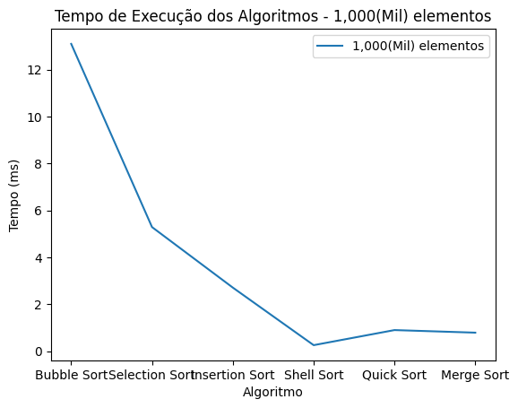
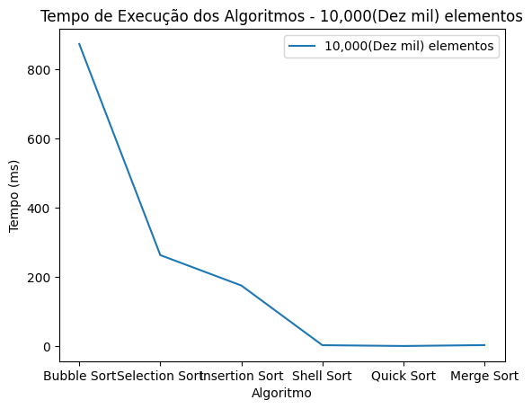

# Análise - Comparação de eficiência entre algoritmos de ordenação

## Introdução

Durante a disciplina de estrutura de dados ministrada no 3° período do curso de Tecnologia em Sistemas para Internet (TSI) foi proposto que implementássemos os algoritmos de ordenação apresentados em sala, e que apartir destes fosse realizada uma análise e comparação do tempo de execução de cada um, de forma que se torne possivel visualizar de forma mais clara a discrepância entre a eficiência de cada algoritmo.

### Algoritmos de Ordenação

Algoritmos de ordenação são uma parte fundamental da ciência da computação e da programação. Eles permitem que os programadores organizem e classifiquem grandes quantidades de dados de forma rápida e eficiente. Dentre os muitos algoritmos de ordenação disponíveis, alguns dos mais comuns incluem o Bubble Sort, Selection Sort, Insertion Sort, Shell Sort, Quick Sort e Merge Sort. Neste artigo, vamos examinar cada um desses algoritmos em detalhes.

    1. Bubble Sort O Bubble Sort é um algoritmo simples de ordenação que funciona comparando elementos adjacentes em uma lista e trocando-os se estiverem fora de ordem. Ele continua fazendo essas comparações e trocas até que toda a lista esteja em ordem. Embora seja fácil de entender e implementar, o Bubble Sort tem uma complexidade de tempo de O(n²), o que significa que seu desempenho pode ser bastante lento em listas grandes.
    2. Selection Sort O Selection Sort é um algoritmo que começa encontrando o menor elemento em uma lista e colocando-o na primeira posição. Em seguida, ele encontra o próximo menor elemento e o coloca na segunda posição, e assim por diante até que toda a lista esteja em ordem. Como o Bubble Sort, o Selection Sort também tem uma complexidade de tempo de O(n²), o que o torna ineficiente em listas grandes.  
    3. Insertion Sort O Insertion Sort é um algoritmo de ordenação que funciona "inserindo" elementos em uma lista já ordenada. Ele começa com o primeiro elemento e o considera uma lista ordenada. Em seguida, ele pega o próximo elemento e o insere na posição correta na lista ordenada. Ele continua fazendo isso para cada elemento subsequente até que toda a lista esteja em ordem. O Insertion Sort tem uma complexidade de tempo média de O(n²), mas é mais rápido do que o Bubble Sort e o Selection Sort em listas pequenas.  
    4. Shell Sort O Shell Sort é um algoritmo de ordenação que melhora o desempenho do Insertion Sort, dividindo a lista em subgrupos menores e ordenando-os separadamente. Ele começa dividindo a lista em subgrupos de elementos que estão distantes um do outro e, em seguida, ordena cada subgrupo usando o Insertion Sort. Em seguida, ele reduz a distância entre os elementos nos subgrupos e repete o processo de ordenação até que toda a lista esteja em ordem. O Shell Sort tem uma complexidade de tempo média de O(n log n), o que o torna mais rápido do que o Bubble Sort, o Selection Sort e o Insertion Sort em listas maiores.  
    5. Quick Sort O Quick Sort é um algoritmo de ordenação que utiliza uma abordagem "dividir e conquistar". Ele divide a lista em dois subconjuntos menores, um com elementos maiores do que um valor escolhido (pivô) e outro com elementos menores. Em seguida, ele ordena recursivamente cada subconjunto e os junta para produzir uma lista ordenada completa. O Quick Sort é um dos algoritmos de ordenação mais eficientes, com uma complexidade de tempo média de O(n log n), mas pode ser lento em listas quase ordenadas.  
    6. Merge Sort O Merge Sort é um algoritmo de ordenação que utiliza uma abordagem "dividir e conquistar". Ele divide a lista em subconjuntos menores, recursivamente, até que a lista seja reduzida a apenas um elemento. Em seguida, ele junta esses subconjuntos, ordenando-os, até que a lista original esteja completamente ordenada. Esse processo de "dividir e conquistar" permite que o Merge Sort alcance uma complexidade de tempo média de O(n log n). O processo de junção dos subconjuntos é chamado de "merge". Ele envolve comparar os primeiros elementos de cada subconjunto e colocar o menor deles na lista de saída. O processo é repetido até que todos os elementos dos subconjuntos tenham sido adicionados à lista de saída.

## Metodologia

### Automatização com shell script

Após criado o repositório no github para armazenar os códigos de cada algoritmo, foi necessário pensar em como realizariamos a análise.

Antes de tudo, criamos na pasta do projeto um script em shell que automatiza a execução de cada algoritmo, por meio do comando `./cmd`.

Dessa forma caso o programador deseje testar um único algoritmo não é necessário que a cada alteração o usuário tenha que executar o comando `g++ <nome-do-arquivo> -o executavel` para compilar o código, pois o script automatiza esse processo, resumindo a compilação e execução de todos os algoritmos a um único comando.

No entanto, para a comparação, criamos um arquivo main.cpp que contém todas as funções que executam cada algoritmo, ele cria um único array com valores aleatórios e passa ele como paramêtro para cada método, por fim, exibe no terminal o tempo em segundos e milésimos com a duração de cada um.

### Bibliotecas auxiliares

A linguagem de programação C++ oferece muitas bibliotecas padrão que fornecem recursos poderosos e flexíveis para manipulação de dados, geração de números aleatórios e medição de tempo. Neste artigo, falaremos sobre as bibliotecas que utilizamos neste projeto:

    1. Biblioteca <vector>
    A biblioteca vector é usada para criar vetores dinâmicos, que são coleções de elementos de tamanho variável que podem ser adicionados ou removidos facilmente. Um vetor dinâmico é essencialmente um array que pode mudar de tamanho durante a execução do programa.Na execução do código de cada algoritmo, o usuário informa a quantidade de elementos do vetor que será ordenado, esse array é preenchido por meio de um loop for com números aleatórios entre 0 a 99.

    2. Biblioteca <random>
    A biblioteca <random> é usada para gerar números aleatórios em C++. Ela oferece vários tipos de distribuição, como a distribuição uniforme, a distribuição normal e a distribuição de Poisson. Ela também oferece diferentes motores de geração de números aleatórios, que são usados para produzir sequências diferentes de números aleatórios.
    Para que fosse possivel inserirmos dinâmicamente os elementos do array a cada repetição do laço, utilizamos a biblioteca `vector` por meio do método push_back() que adiciona cada valor ao fim do array. Dentro do parametro da função é passado o número aleatório armazenado, este que é gerado graças a importação do `random`.

Dessa forma o algoritmo realiza a cada execução a ordenação de um vetor de números aleatórios com a quantidade de elementos que o usuário informar.

Além disso para obtermos o tempo de execução de cada algoritmo, utilizamos o `chrono`, aonde por meio deste delimitamos o trecho específico de código em que o tempo seria capturado, marcando o ponto de início e fim da execução do algoritmo.

Após isso, é realizado o cálculo da diferença entre o intervalo cronometrado, exibindo na tela a quantidade de tempo necessária para a execução do algoritmo em segundos e milissegundos.

## Resultados

Realizamos os testes com cada algoritmo, armazenando em uma planilha o tempo necessário em milissegundos de cada execução para vetores com 1000(Mil), 10.000(Dez mil) e 100.000(Cem mil) elementos.

|                | Mil    | Dez Mil | Cem Mil |
| -------------- | ------ | ------- | ------- |
| Bubble Sort    | 10.801 | 733.049 | 534.219 |
| Selection Sort | 3.382  | 226.285 | 222.929 |
| Insertion Sort | 1.625  | 146.256 | 180.982 |
| Shell Sort     | 0.800  | 64.380  | 78.750  |
| Quick Sort     | 2.292  | 28.781  | 72.587  |
| Merge Sort     | 0.461  | 4.725   | 62.526  |

Para uma melhor visualização desses dados, utilizamos o python com os recursos do matplotlib e pandas para a geração de gráficos:

###### Gráfico 1 -

###### Gráfico 2 -

###### Gráfico 3 -

Da esquerda para a direita estão sendo exibidos os algoritmos considerados mais eficientes em ordenação.

## Conclusão

Analisando cada gráfico é possivel observar a diferença entre o tempo de execução de cada um e o quanto isso depende do tamanho da entrada.

Alguns algoritmos possuem uma eficiência significativa em vetores maiores, porém tem uma menor eficácia em conjuntos com número menor de elementos, e o oposto também acontece.

No entanto, vale ressaltar que os dados deste trabalho são a titulo de pesquisa, os tempos de execução podem variar dependendo do hardware utilizado para a execução dos algoritmos, da linguagem de programação que foi usada, e do próprio algoritmo em si. Portanto, é importante considerar esses fatores ao interpretar os resultados.
